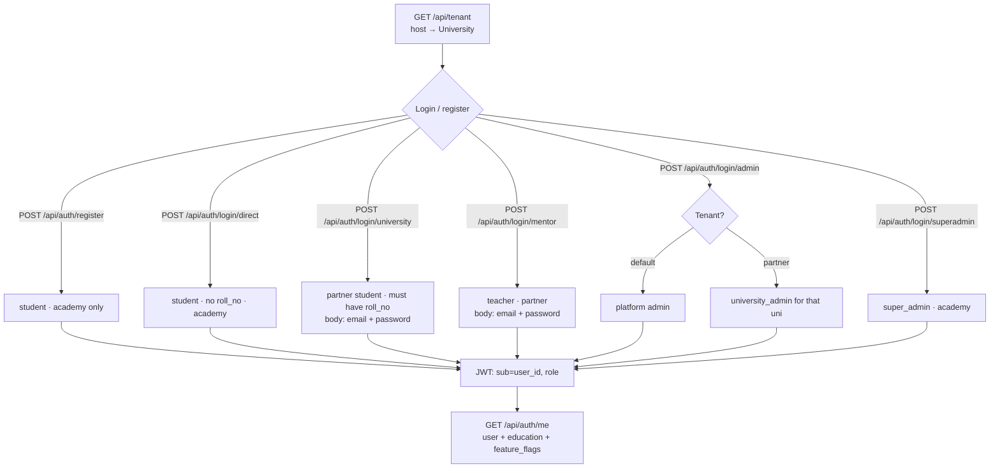
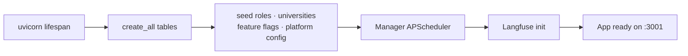

# WorkLearn backend flow

User-facing backend flow for WorkLearn, based on FastAPI wiring in `backend/app/main.py`, auth in `app/core/auth.py`, and role gates in `app/core/permissions.py`.

**Key entry files**

- `backend/app/main.py` — app lifespan, middleware, router mounts
- `backend/app/core/auth.py` — JWT create/decode, `get_current_user`
- `backend/app/core/permissions.py` — `require_roles`, `require_permission`
- `backend/app/api/v1/auth/auth.py` — register / login / me
- `backend/app/api/v1/tenant.py` — tenant resolution from host

---

## Request path (every API call)

```mermaid
flowchart TD
  C[Client HTTP request] --> M1[RequestIdMiddleware]
  M1 --> M2[CORSMiddleware]
  M2 --> R{Route match}

  R -->|Public| P[/api/tenant · /api/auth/* · /health · /static]
  R -->|Bearer JWT| A[get_current_user<br/>decode JWT]
  A --> Role{require_roles / route checks}
  Role -->|403| X[Insufficient role / inactive]
  Role -->|OK| H[Handler]
  H --> DB[(Postgres via AsyncSession)]
  H --> AI[LLM / Langfuse optional]
  H --> SB[Docker sandbox optional]
  H --> RES[JSON response]
```

---

## Auth → identity (who the user becomes)



**Frontend note:** Partner UI offers student (`/university/login`), teacher (`/mentor/login`), and University Admin (`/admin` → `/university-admin`). Forms post **email + password**. Client sends `X-WorkLearn-Host` for tenant resolution. Platform Admin (`admin`) and University Admin (`university_admin`) are separate portals — see [`TEST_LOGINS.md`](TEST_LOGINS.md).

---

## Student API journey

```mermaid
flowchart TD
  ME[Authenticated student] --> ON[PUT /api/users/me/profile<br/>POST .../education<br/>POST .../complete-onboarding]

  ON --> CAT[GET /api/simulations]
  CAT --> ENR[POST /api/simulations/{id}/enroll]
  ENR --> OBD[GET/POST .../onboarding · accept]
  OBD --> RUN{Simulation work}

  RUN --> FULL[GET /api/simulations/{id}/full]
  RUN --> CODE[POST /api/sandbox/{enrollment}/tasks/{task}/submit]
  RUN --> RP[POST .../roleplay-message · grade-text]
  RUN --> DONE[POST /api/enrollments/{id}/tasks/{task}/complete]

  ME --> AIM[POST /api/chat · Skill GPS · history]
  ME --> AN[GET /api/analytics]
  ME --> BAD[GET /api/users/me/badges · certificates]
  ME --> MSG[GET /api/agent-messages]
  ME --> PORT[/api/users/me/* profile photo resume]
```

---

## Teacher / Admin / Super Admin APIs

```mermaid
flowchart TD
  subgraph Teacher
    T0[require teacher / super_admin] --> T1[GET /api/mentor/students]
    T1 --> T2[POST/DELETE unlock features]
  end

  subgraph Admin["Platform Admin"]
    A0[require_roles ADMIN] --> A1[POST /universities/onboard · PATCH universities]
    A0 --> A2[/api/admin/simulations CMS · sim-builder]
    A0 --> A3[feature flags · platform config · analytics]
    A0 --> A4[GET users · provision any partner role]
  end

  subgraph UniAdmin["University Admin"]
    U0[require_roles UNIVERSITY_ADMIN] --> U1[GET/suspend users · own org students/teachers]
    U0 --> U2[POST provision student/teacher only]
  end

  subgraph SuperAdmin
    S0[super_admin gated routes] --> S1[/api/admin-management/admins roles audit-log]
    S0 --> S2[Also reaches Admin surface via require_permission]
  end
```

---

## Startup (before any user request)



---

## Role → API surface

| Role | Typical API prefixes | Frontend login surface |
|------|----------------------|------------------------|
| **student** (academy) | `/api/auth`, `/api/users/me`, simulations, sandbox, chat, … | `/login` |
| **student** (partner) | same student APIs | `/university/login` only |
| **teacher** | `/api/mentor/*` | `/mentor/login` only |
| **admin** | `/api/admin/*` (onboard universities, CMS, provision any partner), sim-builder | `/admin` (academy) |
| **university_admin** | Scoped `/api/admin/users`, provision student/teacher in own org only | Partner `/admin` → `/university-admin` |
| **super_admin** | `/api/admin-management/*` (+ admin surface); **not** university onboard | `/super-admin` |
| **anyone (pre-auth)** | `GET /api/tenant`, auth login/register, `/health`, `/static` | — |

---

## Auth endpoint map

| Method | Path | Who it creates / accepts | Request body |
|--------|------|--------------------------|--------------|
| `POST` | `/api/auth/register` | New academy student | `name`, `email`, `password` |
| `POST` | `/api/auth/login/direct` | Academy student (no `roll_no`) | `email`, `password` |
| `POST` | `/api/auth/login/university` | Partner student (must have `roll_no`) | `email`, `password` |
| `POST` | `/api/auth/login/mentor` | Teacher on partner tenant | `email`, `password` |
| `POST` | `/api/auth/login/admin` | Platform `admin` (academy) or `university_admin` (partner) | `email`, `password` |
| `POST` | `/api/auth/login/superadmin` | Super admin | `email`, `password` |
| `GET` | `/api/auth/me` | Current user (JWT required) | — |

---

## Mounted routers (`main.py`)

| Router module | Prefix / area |
|---------------|---------------|
| `auth` | `/api/auth` |
| `tenant` | `/api/tenant` |
| `profile` | `/api/users/me` |
| `certificates` | `/api` (certificates) |
| `enrollments` | `/api` (simulations, enrollments, badges) |
| `sandbox` | `/api/sandbox` |
| `sim_runtime` | `/api/simulations` (full, roleplay, grade) |
| `ai_mentor` | `/api` (chat, skill-gps) |
| `mentor` | `/api/mentor` |
| `analytics` | `/api` |
| `admin` | `/api/admin` |
| `admin_simulations` | `/api/admin/simulations` |
| `admin_sim_builder` | `/api/admin/sim-builder` |
| `provisioning` | `/api/admin/provision` |
| `admin_management` | `/api/admin-management` |
| `feature_flags` / `platform_config` / `platform_analytics` | `/api/admin-management/*` |
| `health` | `/health` |
| StaticFiles | `/static` |
